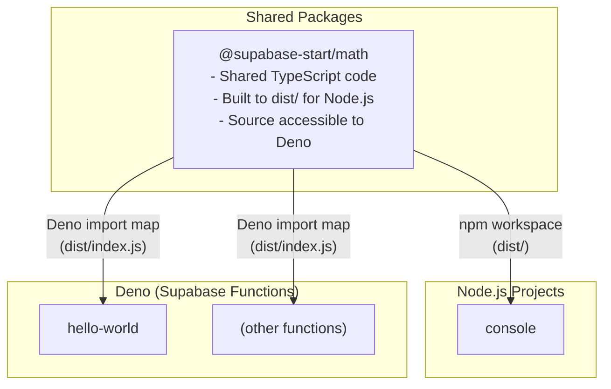

# Supabase Functions Monorepo

A monorepo architecture that enables **code sharing between Node.js projects and Supabase Deno functions**. This setup allows you to write shared TypeScript code once and use it across both Node.js applications (like web apps, CLI tools, or backend services) and Supabase Edge Functions (which run on Deno).

## Goal

The primary goal of this monorepo is to:

1. **Share code between Node.js and Deno environments** - Write shared business logic, utilities, and types once and use them in both Node.js projects and Supabase Edge Functions
2. **Maintain a unified development workflow** - Use a single monorepo to manage both Node.js and Deno-based projects
3. **Enable code reuse** - Avoid duplicating business logic across different runtime environments (Node.js and Deno)

## Architecture Overview



### Key Components

- **Shared Packages** (`packages/math/`): TypeScript code that can be used by both Node.js and Deno
  - Built to `dist/` for consumption by both environments
  - Source TypeScript files in `src/`
  - Built JavaScript files in `dist/` (used by both Node.js and Deno)
- **Node.js Projects** (e.g., `packages/console/`):
  - Consume shared packages via npm workspace dependencies
  - Import from built `dist/` files
- **Supabase Functions** (`packages/backend/supabase/functions/`):
  - Deno-based Edge Functions
  - Access shared code via Deno import maps pointing to built `dist/` files

## Tech Stack

### Core Technologies

- **TypeScript** - Type safety across Node.js and Deno environments
- **Deno** - Runtime for Supabase Edge Functions
- **Node.js** - Runtime for Node.js projects (console, web apps, etc.)
- **Supabase** - Backend platform with Edge Functions support
- **Turborepo** - Optimized monorepo build system
- **npm** - Package manager

## Code Sharing Strategy

### How It Works

1. **Shared Package Structure** (`packages/math/`):
   - Source TypeScript files in `src/`
   - Built output in `dist/` (for Node.js)
   - `package.json` exports both source and built files

2. **Node.js Consumption** (e.g., `packages/console/`):
   - Uses npm workspace dependencies: `"@supabase-start/math": "*"`
   - Imports from the built `dist/` files
   - Standard Node.js module resolution

3. **Deno Consumption** (Supabase Functions):
   - Uses Deno import maps in `deno.json`
   - Points to the built `dist/` files: `"@supabase-start/math": "../../../../math/dist/index.js"`
   - Deno can directly import JavaScript/TypeScript files

### Development Workflow

When you make changes to shared code (`packages/math/src/`):

1. **Rebuild the shared package**:

   ```bash
   cd packages/math
   npm run build
   # Or from root:
   npm run build --workspace=@supabase-start/math
   ```

2. **Restart Supabase Functions server**:

   ```bash
   cd packages/backend
   npx supabase functions serve --no-verify-jwt
   ```

   > **Note**: The functions server needs to be restarted to pick up changes from the rebuilt shared package. Hot reloading for shared dependencies is not currently supported.

3. **Node.js projects** (like `console`) will automatically pick up changes if they're running in watch mode, or you may need to restart them.

### Why This Approach?

- **Deno Compatibility**: Supabase Functions run on Deno, which has different module resolution than Node.js
- **Type Safety**: Both environments get full TypeScript support
- **Build Once**: Shared code is built once and consumed by both environments
- **Monorepo Benefits**: Single source of truth for shared logic, easier refactoring

### Example: Using Shared Code

**Shared Package** (`packages/math/src/index.ts`):

```typescript
export function add(a: number, b: number): number {
  return a + b;
}
```

**In Node.js** (`packages/console/src/index.ts`):

```typescript
import { add } from "@supabase-start/math"; // Uses npm workspace

const result = add(5, 3);
console.log(`Result: ${result}`);
```

**In Deno/Supabase Function** (`packages/backend/supabase/functions/hello-world/index.ts`):

```typescript
import { add } from "@supabase-start/math"; // Uses Deno import map

Deno.serve(async (req) => {
  const result = add(1, 2);
  return new Response(JSON.stringify({ result }));
});
```

The Deno import map (`packages/backend/supabase/functions/hello-world/deno.json`) maps the package name to the built file:

```json
{
  "imports": {
    "@supabase-start/math": "../../../../math/dist/index.js"
  }
}
```

## Project Structure

```
supabase-start/
├── packages/
│   ├── math/                   # Shared package (used by Node.js & Deno)
│   │   ├── src/                # Source TypeScript files
│   │   ├── dist/               # Built output (for Node.js & Deno)
│   │   ├── package.json        # Package exports configuration
│   │   └── deno.json           # Deno configuration
│   ├── console/                # Node.js package (uses shared math)
│   │   ├── src/
│   │   └── package.json        # Depends on @supabase-start/math
│   └── backend/                # Backend package (Supabase)
│       ├── supabase/
│       │   ├── functions/      # Supabase Edge Functions (Deno)
│       │   │   └── hello-world/
│       │   │       ├── index.ts # Uses @supabase-start/math
│       │   │       └── deno.json # Import map for shared code
│       │   └── config.toml     # Supabase configuration
│       └── package.json
├── deno.json                   # Root Deno workspace config
├── package.json                # Root package.json (monorepo config)
└── turbo.json                  # Turborepo configuration
```

## How to Setup

### Prerequisites

- Node.js (v18 or higher)
- npm (v10 or higher)
- Supabase CLI (for local development)

### Setup Steps

1. **Clone the repository and install dependencies:**

   ```bash
   git clone <repository-url>
   cd supabase-start
   npm install
   ```

2. **Build shared packages:**

   ```bash
   npm run build --workspace=@supabase-start/math
   ```

   This builds the shared `math` package that will be used by both Node.js projects and Supabase Functions.

3. **Start Supabase locally (optional, for testing functions):**

   ```bash
   cd packages/backend
   npm run dev
   ```

4. **Start Supabase Functions server:**

   ```bash
   cd packages/backend
   npx supabase functions serve --no-verify-jwt
   ```

   This starts the local functions server. Functions will be available at `http://localhost:54321/functions/v1/<function-name>`

## Available Scripts

### Root Level

- `npm run build` - Build all packages (including shared packages)
- `npm run check-types` - Check TypeScript types across all packages

### Shared Package (`packages/math`)

- `npm run build` - Build the shared package to `dist/` (required before using in functions)
- `npm run check-types` - Type-check the shared package

### Backend Package (`packages/backend`)

- `npm run dev` - Start Supabase local instance
- `npm run dev:functions` - Start Supabase functions server (`npx supabase functions serve --no-verify-jwt`)
- `npm run status` - Show Supabase local instance status

### Console Package (`packages/console`)

- `npm run dev` - Run console package in watch mode (uses tsx)
- `npm run build` - Build console package
- `npm run check-types` - Type-check the console package

## Development Workflow for Shared Code

When working with shared code that's used by both Node.js projects and Supabase Functions:

1. **Make changes** to `packages/math/src/`

2. **Rebuild the shared package**:

   ```bash
   npm run build --workspace=@supabase-start/math
   ```

3. **Restart the Supabase Functions server** (if running):

   ```bash
   cd packages/backend
   npx supabase functions serve --no-verify-jwt
   ```

4. **Node.js projects** will pick up changes automatically if running in watch mode, or restart them if needed.

> **Current Limitation**: The Supabase Functions server doesn't automatically detect changes in shared dependencies. You need to manually rebuild and restart the functions server when shared code changes. This is a known limitation of the current setup.

## Testing Shared Code

### Test in Node.js (Console Package)

```bash
cd packages/console
npm run dev
```

This will run the console package which imports and uses the shared `math` package.

### Test in Supabase Function

1. **Build the shared package:**

   ```bash
   npm run build --workspace=@supabase-start/math
   ```

2. **Start the functions server:**

   ```bash
   cd packages/backend
   npx supabase functions serve --no-verify-jwt
   ```

3. **Invoke the function:**

   ```bash
   curl -i --location --request POST 'http://127.0.0.1:54321/functions/v1/hello-world' \
     --header 'Authorization: Bearer <your-anon-key>' \
     --header 'Content-Type: application/json'
   ```

   The function will use the shared `add` function from `@supabase-start/math` and return the result.
